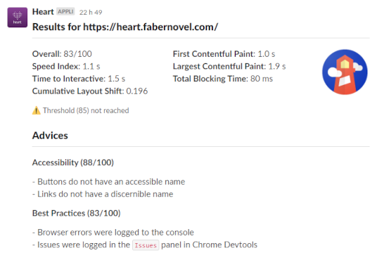

<p style="text-align: center;">

</p>

# Description

_Heart_ is command-line tool written in Node.js that centralize the analyse of webpages using different third-party services, like [_Google Lighthouse_](https://pagespeed.web.dev/), [_ecoIndex_](https://www.ecoindex.fr/) or [_Mozilla Observatory_](https://observatory.mozilla.org/).

The results of these analysis can then be:
- stored into a database to track metrics over time with tools like Grafana
- send into collaborative platforms like Slack.

# Usage

>>>
I want to:
- analyze https://heart.fabernovel.com/ using the _Google Lighthouse_ service.
- be notified on the `#heart` Slack channel when the analysis is over.
- check if the score reach a minimum of 85.
>>>

## Manual

1. Install the packages
    
    ```bash
    npm install @fabernovel/heart-cli @fabernovel/heart-lighthouse @fabernovel/heart-slack
    ```

2. Configure the Slack module
    
    ```bash
    echo HEART_SLACK_API_TOKEN=My_Slack_Api_Token >> .env
    ```

3. Start an analysis

    ```bash
    npx heart lighthouse --inline '{"url":"https://heart.fabernovel.com/"}' --threshold 85
    ```

Here is an extract of what the Slack notification looks like:



## Automated with Github Action

If you're using Github, you can simplify the integration of Heart in your CI scripts by using the [Github Action](https://github.com/marketplace/actions/heart-webpages-evaluation).

# Design

_Heart_ has been designed to be as light as possible, which explains its modular structure: you only install what you need.

## Modules types

To do so, _Heart_ is divided in 3 types of modules:

| Type | Mission | Example |
| ------ | ------ | ------ |
| Runner | Starts an analysis | using a CLI or an API |
| Analysis | Analyzes URLs using third-party services | using _Mozilla Observatory_ |
| Listener | Do thing with the results of the analysis | send them into a _Slack_ channel |

**The minimum setup you need to run _Heart_, is to have the _Heart CLI_ _runner_ module and a single _analysis_ module.**

## Modules list

| Name | Type | Purpose | |
| ------ | ------ | ------ | ------ |
| Heart API | Runner | Exposes an HTTP API that starts an analysis when it is requested | [](https://www.npmjs.com/package/@fabernovel/heart-api "View Heart API on npmjs.com") |
| Heart CLI | Runner | Control the other modules by using a CLI | [](https://www.npmjs.com/package/@fabernovel/heart-cli "View Heart CLI on npmjs.com") |
| Heart GreenIT | Analysis | Analyzes URLs with [GreenIT Analysis](https://chrome.google.com/webstore/detail/greenit-analysis/mofbfhffeklkbebfclfaiifefjflcpad?hl=en) | [](https://www.npmjs.com/package/@fabernovel/heart-greenit "View Heart GreenIT on npmjs.com") |
| Heart Lighthouse | Analysis | Analyzes URLs with [Google Lighthouse](https://developers.google.com/web/tools/lighthouse) | [](https://www.npmjs.com/package/@fabernovel/heart-lighthouse "View Heart Lighthouse on npmjs.com") |
| Heart Observatory | Analysis | Analyzes URLs with [Mozilla Observatory](https://observatory.mozilla.org/) | [](https://www.npmjs.com/package/@fabernovel/heart-observatory "View Heart Observatory on npmjs.com") |
| Heart SSL Labs Server | Analysis | Analyzes URLs with [Qualys SSL Labs Server](https://www.ssllabs.com/ssltest/) | [](https://www.npmjs.com/package/@fabernovel/heart-ssllabs-server "View Heart SSL Labs Server on npmjs.com") |
| Heart BigQuery | Listener | Stores the results of the analysis into a [Google BigQuery](https://cloud.google.com/bigquery) table | [](https://www.npmjs.com/package/@fabernovel/heart-bigquery "View Heart BigQuery on npmjs.com")
| Heart MySQL | Listener | Stores the results of the analysis into a [MySQL](https://www.mysql.com) database | [](https://www.npmjs.com/package/@fabernovel/heart-mysql "View Heart MySQL on npmjs.com")
| Heart Slack | Listener | Sends the results of the analysis to a [Slack](https://slack.com) channel | [](https://www.npmjs.com/package/@fabernovel/heart-slack "View Heart Slack on npmjs.com") |
